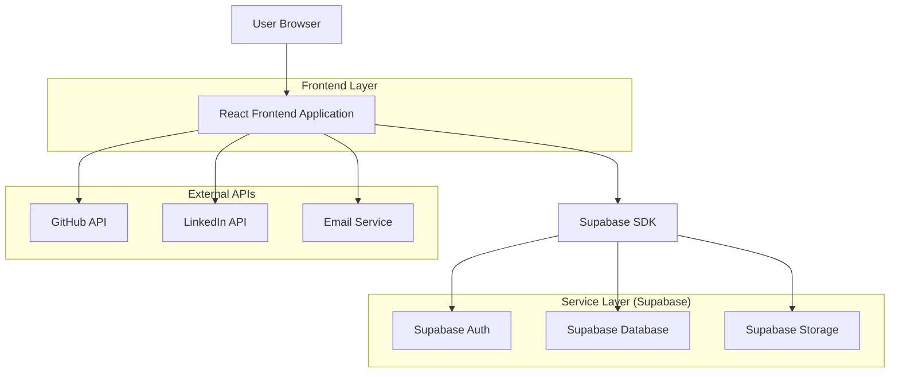
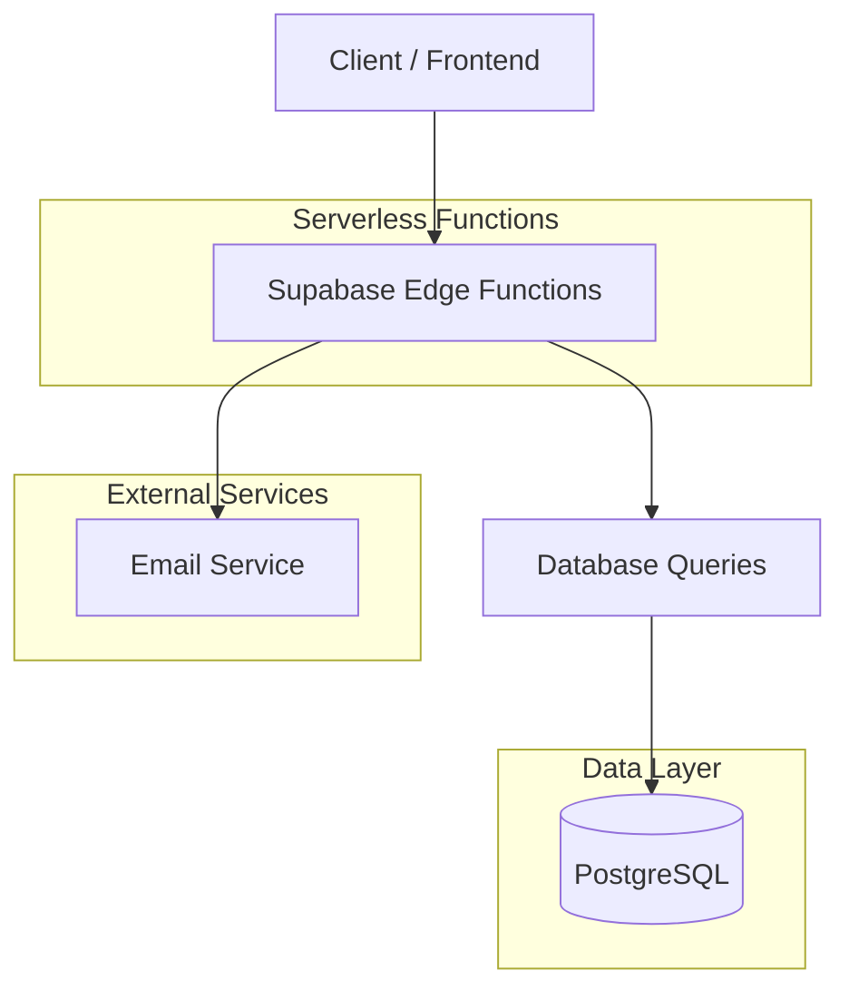
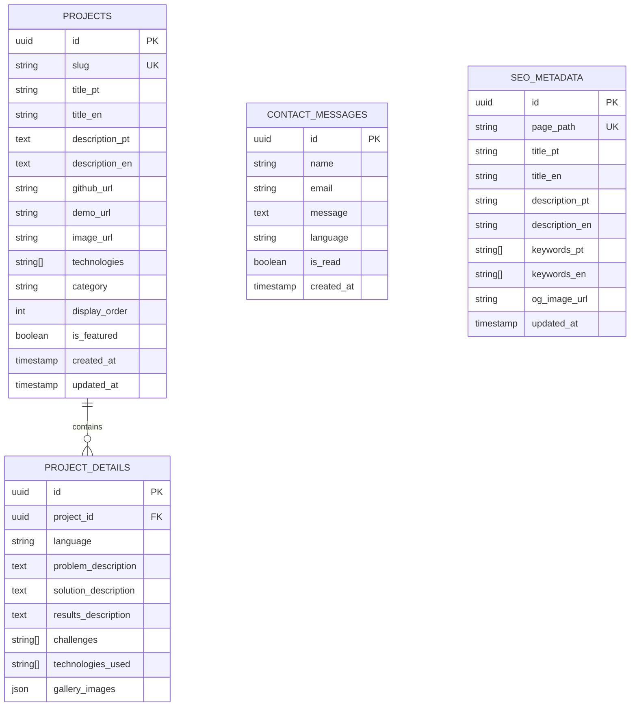

## 1. Architecture design



## 2. Technology Description

- **Frontend**: React@18 + TypeScript + Tailwind CSS@3 + Vite
- **Initialization Tool**: vite-init
- **Backend**: Supabase (BaaS)
- **Database**: PostgreSQL (via Supabase)
- **Storage**: Supabase Storage para imagens de projetos
- **Email**: Supabase Edge Functions com Resend API
- **SEO**: React Helmet Async + Sitemap generation

## 3. Route definitions

| Route | Purpose |
|-------|---------|
| / | Home page, hero section e navegação principal |
| /projects | Lista de projetos com filtros e busca |
| /projects/:slug | Detalhe do projeto com template de case |
| /contact | Formulário de contato e links sociais |
| /api/webhook/contact | Endpoint para processar formulário de contato |

## 4. API definitions

### 4.1 Core API

**GitHub Projects Integration**
```
GET /api/github/repos
```

Response:
| Param Name | Param Type | Description |
|------------|-------------|-------------|
| repos | array | Lista de repositórios públicos |
| name | string | Nome do repositório |
| description | string | Descrição do projeto |
| language | string | Linguagem principal |
| stars | number | Número de estrelas |
| url | string | URL do repositório |

**Contact Form Submission**
```
POST /api/contact
```

Request:
| Param Name | Param Type | isRequired | Description |
|------------|-------------|-------------|-------------|
| name | string | true | Nome do visitante |
| email | string | true | Email para resposta |
| message | string | true | Mensagem do formulário |
| language | string | false | Idioma preferido (pt/en) |

## 5. Server architecture diagram



## 6. Data model

### 6.1 Data model definition



### 6.2 Data Definition Language

**Projects Table**
```sql
-- create table
CREATE TABLE projects (
    id UUID PRIMARY KEY DEFAULT gen_random_uuid(),
    slug VARCHAR(255) UNIQUE NOT NULL,
    title_pt VARCHAR(255) NOT NULL,
    title_en VARCHAR(255) NOT NULL,
    description_pt TEXT,
    description_en TEXT,
    github_url VARCHAR(500),
    demo_url VARCHAR(500),
    image_url VARCHAR(500),
    technologies TEXT[],
    category VARCHAR(100),
    display_order INTEGER DEFAULT 0,
    is_featured BOOLEAN DEFAULT false,
    created_at TIMESTAMP WITH TIME ZONE DEFAULT NOW(),
    updated_at TIMESTAMP WITH TIME ZONE DEFAULT NOW()
);

-- create indexes
CREATE INDEX idx_projects_slug ON projects(slug);
CREATE INDEX idx_projects_category ON projects(category);
CREATE INDEX idx_projects_featured ON projects(is_featured);

-- grant permissions
GRANT SELECT ON projects TO anon;
GRANT ALL PRIVILEGES ON projects TO authenticated;
```

**SEO Metadata Table**
```sql
-- create table
CREATE TABLE seo_metadata (
    id UUID PRIMARY KEY DEFAULT gen_random_uuid(),
    page_path VARCHAR(255) UNIQUE NOT NULL,
    title_pt VARCHAR(255),
    title_en VARCHAR(255),
    description_pt TEXT,
    description_en TEXT,
    keywords_pt TEXT[],
    keywords_en TEXT[],
    og_image_url VARCHAR(500),
    updated_at TIMESTAMP WITH TIME ZONE DEFAULT NOW()
);

-- create index
CREATE INDEX idx_seo_page_path ON seo_metadata(page_path);

-- grant permissions
GRANT SELECT ON seo_metadata TO anon;
GRANT ALL PRIVILEGES ON seo_metadata TO authenticated;

-- insert initial SEO data
INSERT INTO seo_metadata (page_path, title_pt, title_en, description_pt, description_en, keywords_pt, keywords_en) VALUES
('/', 'Edson Santos - Desenvolvedor Web', 'Edson Santos - Web Developer', 'Portfólio de desenvolvedor web full-stack', 'Full-stack web developer portfolio', '{"desenvolvedor", "web", "full-stack", "react", "node.js"}', '{"developer", "web", "full-stack", "react", "node.js"}'),
('/projects', 'Projetos - Edson Santos', 'Projects - Edson Santos', 'Conheça meus projetos e cases de sucesso', 'Check out my projects and success cases', '{"projetos", "cases", "desenvolvimento", "web"}', '{"projects", "cases", "development", "web"}'),
('/contact', 'Contato - Edson Santos', 'Contact - Edson Santos', 'Entre em contato para oportunidades', 'Get in touch for opportunities', '{"contato", "oportunidades", "freelance"}', '{"contact", "opportunities", "freelance"}');
```