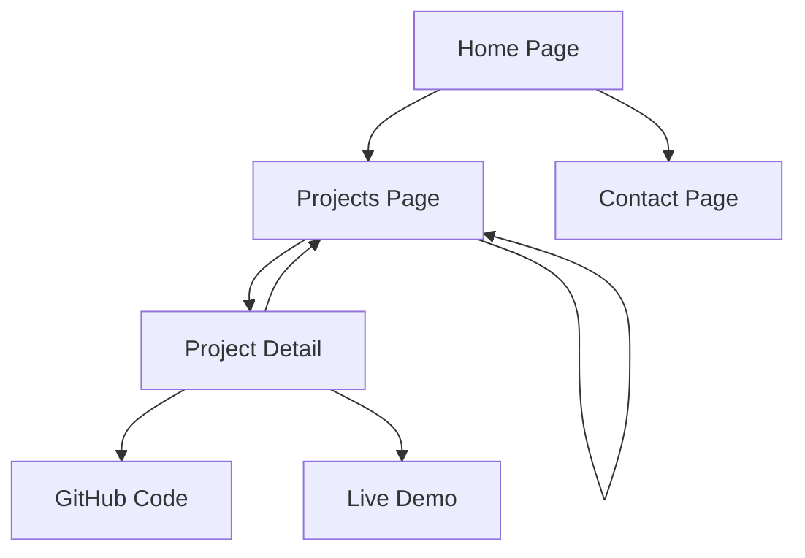

## 1. Product Overview
Portfólio profissional bilíngue (pt/en) para desenvolvedor web, com foco em apresentação de projetos, cases detalhados e integração com redes profissionais. O produto visa maximizar a visibilidade profissional através de SEO otimizado e design responsivo.

- **Problema**: Desenvolvedores precisam de portfólio profissional que alcance recrutadores globalmente
- **Solução**: Plataforma bilíngue com templates de cases, SEO automático e integração GitHub/LinkedIn
- **Público**: Desenvolvedores web, recrutadores técnicos, clientes potenciais

## 2. Core Features

### 2.1 User Roles
| Role | Registration Method | Core Permissions |
|------|---------------------|------------------|
| Admin | Single user system | Full content management, language switching, SEO configuration |
| Visitor | No registration | Browse content, switch languages, view projects |

### 2.2 Feature Module
O portfólio bilíngue consiste nas seguintes páginas principais:
1. **Página Inicial**: hero section, navegação, seção sobre, skills, contato
2. **Página de Projetos**: grid de projetos, filtros por tecnologia, busca
3. **Detalhe do Projeto**: template de case completo, galeria de imagens, links código
4. **Página de Contato**: formulário de contato, links redes sociais

### 2.3 Page Details
| Page Name | Module Name | Feature description |
|-----------|-------------|---------------------|
| Home page | Hero section | Apresentação com animação, foto profissional, título dinâmico bilíngue |
| Home page | Navigation | Menu responsivo com switch de idioma (PT/EN), links âncora smooth scroll |
| Home page | About section | Texto sobre mim bilíngue com contador de experiência dinâmico |
| Home page | Skills section | Cards de tecnologias com níveis de proficiência, ícones coloridos |
| Home page | Contact section | Formulário com validação, integração email, links redes sociais |
| Projects page | Project grid | Cards responsivos com imagem, título, tecnologias, link detalhe |
| Projects page | Filter system | Filtros por categoria/tecnologia, busca por nome, contador de projetos |
| Project detail | Case template | Título bilíngue, descrição detalhada, problemas/soluções, resultados |
| Project detail | Image gallery | Carrossel de screenshots, lightbox, imagens otimizadas WebP |
| Project detail | Code links | Botões GitHub (código fonte), demo link, tecnologias utilizadas |
| Contact page | Contact form | Campos nome, email, mensagem, validação client-side, spam protection |
| Contact page | Social links | Ícones LinkedIn, GitHub, email com hover effects |

## 3. Core Process
**Fluxo do Visitante**: Usário acessa home → navega pelas seções → visualiza projetos → filtra/busca → clica em projeto → lê case detalhado → acessa código/demo → retorna para mais projetos → entra em contato via formulário ou redes sociais.

**Fluxo Admin (desenvolvedor)**: Acessa painel admin → gerencia conteúdo bilíngue → adiciona/edita projetos → configura SEO → publica mudanças → monitora analytics.

## 4. User Interface Design

### 4.1 Design Style
- **Cores primárias**: #0A0E27 (azul escuro), #6366F1 (índigo vibrante)
- **Cores secundárias**: #10B981 (verde menta), #F59E0B (laranja)
- **Botões**: Estilo moderno com border-radius 8px, hover transitions suaves
- **Fontes**: Inter para textos, JetBrains Mono para código
- **Layout**: Card-based com grid responsivo, navegação sticky top
- **Ícones**: Heroicons/Tabler icons minimalistas, animações sutis

### 4.2 Page Design Overview
| Page Name | Module Name | UI Elements |
|-----------|-------------|-------------|
| Home page | Hero section | Background gradient animado, foto circular 200px, título com typing effect, CTA buttons |
| Projects page | Project grid | Cards 3-col (desktop), 2-col (tablet), 1-col (mobile), hover scale 1.05, sombra suave |
| Project detail | Case template | Container max-width 800px, typography hierarchy, code snippets com syntax highlight |
| Contact page | Form section | Inputs com bordas arredondadas, textarea auto-resize, botão submit com loading state |

### 4.3 Responsiveness
**Desktop-first** com breakpoints: 1280px (xl), 1024px (lg), 768px (md), 640px (sm). Touch otimizado para mobile com áreas de toque mínimas 44x44px. Menu hamburger para telas <768px. Imagens responsivas com srcset para performance otimizada.